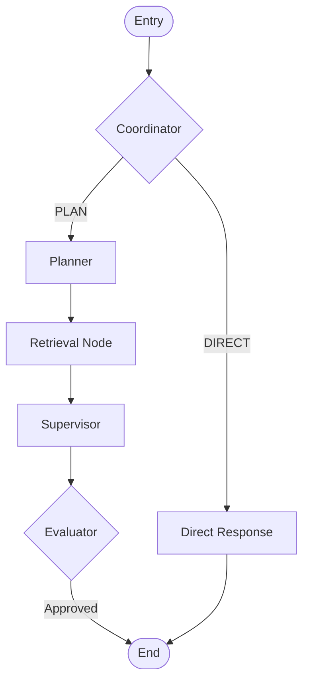

# Agent Workflow & Logic - SocrAItes

이 문서는 SocrAItes 에이전트의 핵심 로직, 상태 관리 및 데이터 흐름(Flow)을 상세히 설명합니다. 에이전트는 [LangGraph](https://langchain-ai.github.io/langgraph/)를 기반으로 구축되었습니다.

## 1. 에이전트 상태 관리 (`AgentState`)
에이전트의 모든 노드는 `AgentState` 객체를 공유하며 데이터를 주고받습니다.
- `messages`: 전체 대화 이력 (사용자 및 AI 메시지 리스트).
- `socratic_depth`: 질문의 깊이 수준 (0: Light, 1: Standard, 2: Deep).
- `frustration_level`: 사용자의 좌절도 수준.
- `retrieved_docs`: RAG 파이프라인을 통해 검색된 관련 강의 자료 청크.
- `next_step`: 다음으로 이동할 노드를 결정하는 라우팅 키.
- `draft_answer`: 생성된 답변 초안.

---

## 2. 전체 워크플로우 (Graph Flow)

에이전트는 사용자의 입력을 받으면 다음과 같은 그래프 구조를 따라 동작합니다.

### 2.1 주요 노드 상세 설명

#### 1) Coordinator (진입점)
- **역할:** 사용자의 쿼리를 분석하여 '학습 질문(PLAN)'인지 '단순 대화(DIRECT)'인지 분류합니다.
- **출력:** `next_step` 변수에 `planner` 또는 `direct_response`를 설정합니다.

#### 2) Planner
- **역할:** 학습 질문인 경우, 어떤 개념을 탐구할지 계획을 세우고 소크라테스식 질문의 목표를 설정합니다.
- **출력:** 실행 계획(`plan`)을 상태에 저장합니다.

#### 3) Retrieval Node
- **역할:** 사용자의 질문을 바탕으로 ChromaDB 벡터 스토어에서 관련도가 높은 강의 자료(PDF) 청크를 검색합니다.
- **출력:** 검색된 문서 리스트를 `retrieved_docs`에 저장합니다.

#### 4) Supervisor (소크라테스 페르소나)
- **역할:** 검색된 자료와 현재까지의 대화 맥락을 종합하여 소크라테스식 답변을 생성합니다. 절대 정답을 바로 말하지 않고, 반문이나 힌트를 통해 사용자의 사고를 유도합니다.
- **출력:** 답변 초안(`draft_answer`)을 생성합니다.

#### 5) Evaluator (품질 검증)
- **역할:** 생성된 답변이 충분히 소크라테스적인지, 제공된 자료에 근거하고 있는지 검증합니다.
- **출력:** 검증 결과(`pass/fail`)에 따라 워크플로우를 종료하거나 피드백을 제공합니다.

#### 6) Direct Response
- **역할:** 인사나 감사 인사 등 학습과 무관한 일상적인 대화에 대해 짧고 친절하게 응답합니다.

---

## 3. 로깅 및 모니터링
에이전트의 실행 과정은 두 가지 방식으로 기록됩니다.

### 3.1 실시간 콘솔 로그
터미널에서 실시간으로 각 노드의 진입과 주요 결정을 확인할 수 있습니다.
- **로그 형식:** `[시간] - SocrAItes.Agent - INFO - --- [노드명] 단계 명칭 ---`

### 3.2 상세 실행 트레이스 파일 (`logs/agent_trace.log`)
그래프의 각 단계별 **상세 LLM 요청(Prompt)과 응답(Response)**을 별도의 파일에 저장합니다. 디버깅 및 프롬프트 최적화에 활용됩니다.
- **위치:** `logs/agent_trace.log`
- **기록 내용:**
  - 실행된 노드 이름 (STEP)
  - LLM에게 전달된 전체 프롬프트 (Request)
  - LLM이 반환한 원본 응답 (Response)
  - 해당 단계의 최종 결정 또는 결과 (Decision/Result)

이 구조를 통해 각 단계가 명확히 분리되어 있어 디버깅이 용이하며, 향후 특정 노드의 LLM 프롬프트를 개선하거나 검색 알고리즘을 변경하기에 매우 유연한 구조를 가지고 있습니다.
