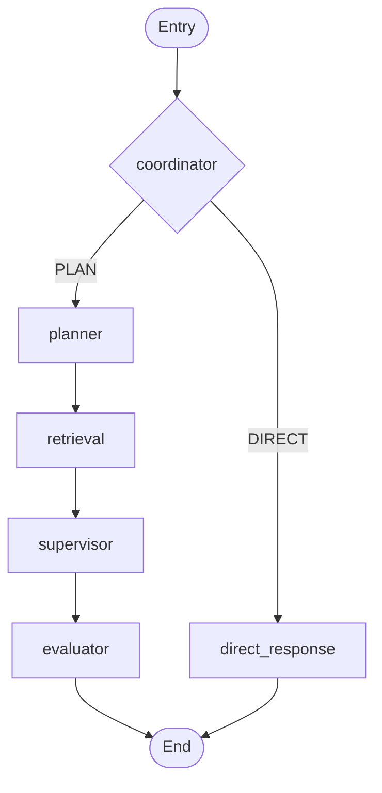

# Agent Workflow & Logic - SocrAItes

이 문서는 `src/agent/graph.py` 기준의 현재 LangGraph 워크플로우를 설명합니다.

## 1. 상태(`AgentState`) 핵심 필드

1. `messages`: 사용자/어시스턴트 대화 이력
2. `socratic_depth`: 대화 깊이(0/1/2)
3. `retrieved_docs`: 검색된 문서 청크 목록
4. `next_step`: 라우팅 키
5. `plan`: planner가 만든 실행 계획
6. `draft_answer`: supervisor가 생성한 응답 초안

## 2. 그래프 구조

## 3. 노드별 역할

### 3.1 coordinator

1. 사용자 마지막 메시지를 분석
2. 학습 질의면 `planner`, 일반 대화면 `direct_response`로 라우팅

### 3.2 planner

1. 질의의 핵심 개념과 진행 계획 생성
2. 계획을 `plan`에 저장

### 3.3 retrieval

1. 마지막 사용자 질문으로 문서 검색
2. `src/rag/vectorstore.py`의 하이브리드 검색(BM25 + KNN + RRF) 수행
3. 결과를 `retrieved_docs`에 저장

### 3.4 supervisor

1. `plan`, `retrieved_docs`, 대화 이력을 결합
2. 소크라테스식 응답 초안(`draft_answer`) 생성

### 3.5 evaluator

1. 응답 품질 점검(현재는 pass 기반 단순 평가)
2. 그래프 종료

### 3.6 direct_response

1. 인사/잡담/비학습 메시지에 대한 짧은 응답 생성
2. 그래프 종료

## 4. 로깅

### 4.1 콘솔 로그

노드 진입 및 처리 상태를 표준 로깅으로 출력합니다.

### 4.2 트레이스 로그 (`logs/agent_trace.log`)

각 노드에서 다음 정보를 기록합니다.

1. STEP 이름
2. LLM Request
3. LLM Response
4. Decision/Result

LLM 협업 시, 실패 재현이나 프롬프트 개선은 이 파일을 기준으로 진행하는 것이 가장 빠릅니다.
