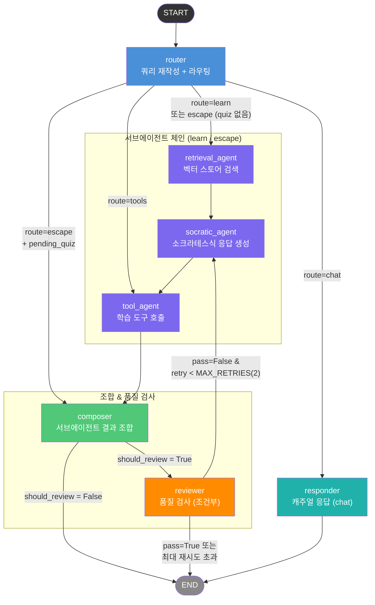

# SocrAItes 프로젝트 결과 보고서

> 빅데이터를 위한 자연어처리 입문 — 4조
>
> 조현호 · 김우림 · 권지수 · 신승윤

---

## 목차

1. [프로젝트 목표와 목적](#1-프로젝트-목표와-목적)
2. [문제 정의 및 개선 배경](#2-문제-정의-및-개선-배경)
3. [마일스톤과 결과물 비교](#3-마일스톤과-결과물-비교)
4. [시스템 아키텍처](#4-시스템-아키텍처)
5. [시연](#5-시연)
6. [회고](#6-회고)

---

## 1. 프로젝트 목표와 목적

### 1.1 한 줄 정의

> "정답을 알려주지 않는 AI, 스스로 답을 찾게 하는 학습 코치"

### 1.2 배경

- 대학원 강의에서 학생은 수업 외 시간에 개념을 독립적으로 소화해야 함
- 질문할 조교·동료가 항상 곁에 있지 않는 환경적 한계 존재
- ChatGPT 등 범용 LLM은 **정답을 즉각 제공**하여 깊은 이해 없이 정보를 수동적으로 소비하게 만드는 문제 있음

### 1.3 목적

| 구분 | 내용 |
| --- | --- |
| **주 타겟** | 강의 내용을 깊이 이해하고 싶지만 질문할 곳이 없는 대학원생 |
| **핵심 가치** | 정답 지연 + 소크라테스식 반문으로 학습자 스스로 개념을 구성하게 함 |
| **성공 지표** | 직답 회피율 80% 이상, RAG Faithfulness 0.85 이상, 반문 비율 60% 이상 |

### 1.4 주요 기능 목표

1. **강의자료 기반 RAG**: 교수 제공 PDF를 벡터 DB에 색인하여 환각을 최소화한 답변 생성
2. **소크라테스식 대화 엔진**: 반문·예시 요구·전제 검토 형식으로 사고 자극
3. **Adaptive Socratic Depth**: 학습자 좌절 신호 감지 → 힌트·난이도 동적 조절 (Scaffolding 단계 상승)
4. **학습 도구 (Function Calling)**: 퀴즈 생성, 복습 일정 등록, 약점 저장, 직답 모드 전환
5. **약점 진단 & 리포트**: 대화 이력 분석 기반 주간 학습 리포트 및 개인화 프로파일 제공

---

## 2. 문제 정의 및 개선 배경

### 2.1 기획 단계에서 식별한 문제

### 문제 1: 범용 LLM의 '정답 즉시 제공' 패턴

- ChatGPT·Gemini 등 기존 AI는 질문 즉시 답변을 제공함
- 단기 효율은 높이나 **메타인지 형성을 방해**하는 부작용 있음
- 학생이 이해 없이 정보를 복사·붙이기하게 되어 시험·실무에서 응용력 저하로 이어짐

### 문제 2: 강의자료와 무관한 답변(환각)

- 범용 LLM은 강의자료와 무관한 정보를 그럴듯하게 생성함
- 교수가 특정 교재·정의를 사용했을 때 AI가 다른 정의를 제시하면 학습 혼란 가중

### 2.2 개발 과정에서 발견한 문제와 개선

### 문제 A: 소크라테스 질문 원칙 정립

- **현상**: 개념 질문에 대한 소크라테스식 첫 질문이 배경이 아닌 세부 기법을 직접 묻거나 엉뚱한 질문을 함
- **원인**: 질문 시작점에 대한 명확한 원칙 없이 프롬프트 예시에만 의존하여 LLM이 일관된 출발점을 잡지 못함
- **해결**: 개념 이해를 위한 소크라테스 접근 원칙 정립
  - 핵심 원칙: 개념을 처음 접하는 학생에게는 **"이 개념이 왜 등장했는가?"** — 즉 해결하려 한 문제·기존 방법의 한계 — 를 먼저 스스로 발견하게 하는 것이 가장 효과적인 출발점임
  - LLM이 내부적으로 Lecture context에서 X의 등장 배경 문제를 먼저 파악
  - 배경 문제로 학생을 이끌기 위해 **학생이 이미 알고 있을 선행 개념**으로 질문 구성
  - 개념의 이름·구성요소·세부 기법을 질문에 포함하는 것을 금지 (정답 노출 방지)
  - 강의 자료에서 배경을 찾지 못하면 Tavily 웹 검색으로 자동 보완

### 문제 B: RAG Top-K 강제 매칭

- **현상**: 색인된 자료와 무관한 질문에도 Elasticsearch가 Top-K 반환
- **원인**: BM25·KNN 하이브리드 검색이 항상 상대적 점수 기준 상위 K개를 반환하도록 설계되어 Out-of-Domain 질문에도 인덱스 내 문서를 강제 반환함
- **해결**: 코사인 유사도 임계값 필터링 도입
  - BGE-M3 Dense 벡터 코사인 유사도 **0.4 미만** 청크를 RRF 계산 전 단계에서 제외

### 문제 C: 동일 질문 무한 반복

- **현상**: 학생이 다음 주제 요청 후에도 직전 주제로 쿼리를 재생성하여 같은 질문 반복함
- **원인**: 쿼리 재구성 로직이 진도 변경 의도를 감지하지 못하고 이전 대화 주제를 그대로 유지함
- **해결**:
  - `socratic_agent`에서 `_count_turns_since_topic_start()` 함수로 현재 토픽 기준 반문 횟수를 동적 계산
  - `_MAX_TURNS = {'light': 2, 'standard': 4, 'deep': 6}` 기준으로 반문 한도 초과 시 직접 설명으로 자동 전환

### 문제 D: 도구 호출 타이밍 최적화

- **현상**: Supervisor가 LLM의 즉흥 판단으로 퀴즈 생성·약점 저장·복습 등록을 호출하여 의도하지 않은 타이밍에 도구 실행됨
- **해결**: 에이전트 계층 분리 (Sub Agent 도입)
  - **Router**가 명시적으로 `route = "tools"` 결정 시에만 `tool_agent` 활성화
  - `route = "learn"` 경로에서는 `retrieval_agent → socratic_agent → composer → reviewer` 순서로만 실행
  - 도구 호출 시점 예측 가능해지고 불필요한 API 호출 제거됨

---

## 3. 마일스톤과 결과물 비교

### 3.1 마일스톤 계획

| 단계 | 목표 기능 |
| --- | --- |
| M1 — 기반 구축 | FastAPI 서버, 기본 RAG (ChromaDB), 소크라테스 페르소나 프롬프트 |
| M2 — RAG 고도화 | Elasticsearch 하이브리드 검색 (BM25 + KNN + RRF), 문맥 인지 쿼리 재구성 |
| M3 — Agent 고도화 | LangGraph 멀티노드, Function Calling 4종, Adaptive Socratic Depth |
| M4 — 개인화 | 사용자 프로파일, 약점 진단, 주간 학습 리포트 |
| M5 — 품질 보증 | Sub Agent 분리, 4축 Reviewer, 재시도 루프, 웹 검색 보강 |

### 3.2 기획 대비 결과물 비교

| 기획 항목 | 계획 | 실제 결과 | 상태 |
| --- | --- | --- | --- |
| **RAG 기반** | ChromaDB 벡터 검색 | **Elasticsearch** BM25 + Dense KNN + RRF 하이브리드 | ✅ 상향 구현 |
| **RAG 정확도** | 단순 Top-K 반환 | 코사인 유사도 임계값(0.4) 필터링으로 Out-of-Domain 완전 차단 | ✅ 상향 구현 |
| **에이전트 구조** | 단일 Supervisor | Router → Sub Agents (Retrieval / Socratic / Tool) → Composer → Reviewer 계층화 | ✅ 상향 구현 |
| **소크라테스 깊이** | 단일 모드 | Light(0) / Standard(1) / Deep(2) 3단계 차별화 + 반문 횟수 제한 | ✅ 상향 구현 |
| **Function Calling** | 4종 도구 | generate_quiz, save_weakness, schedule_review, update_user_profile | ✅ 계획 달성 |
| **퀴즈 기능** | 생성만 | 생성 + 인터랙티브 UI + 채점 + 정답 비공개 로직 | ✅ 상향 구현 |
| **사용자 개인화** | 기획 단계 | 비동기 백그라운드 진단 + user_profiles / strengths / weaknesses DB | ✅ 계획 달성 |
| **품질 보증** | 단순 pass | 4축 Reviewer + 최대 2회 재시도 루프 | ✅ 상향 구현 |
| **좌절 감지** | 키워드 기반 | Router LLM이 대화 맥락 전체로 frustration_level(0~2) 판단 + Scaffolding 힌트 자동 전환 | ✅ 상향 구현 |
| **진도 제어** | 미기획 | 토픽 변경 감지 + 반문 횟수 리셋 | ✅ 추가 구현 |
| **웹 검색 보강** | 미기획 | Deep 모드 / 개념 정의 질문 시 강의자료 배경 지식 부족 여부를 LLM이 판단 후 Tavily 웹 검색 조건부 실행 | ✅ 추가 구현 |
| **실시간 스트리밍** | 미기획 | SSE 기반 에이전트 노드 진행 상황 시각화 | ✅ 추가 구현 |

---

## 4. 시스템 아키텍처

### 4.1 기술 스택

| 계층 | 기술 |
| --- | --- |
| **LLM** | GPT-4o (Socratic Agent, Reviewer), GPT-4o-mini (나머지) |
| **Embedding** | BAAI/bge-m3 (로컬, 1024차원) |
| **Vector DB** | Elasticsearch (BM25 + Dense KNN + RRF 하이브리드) |
| **Agent Orchestration** | LangGraph |
| **Backend** | FastAPI (Python, SSE 스트리밍) |
| **Frontend** | Vanilla HTML/CSS/JavaScript |
| **Database** | SQLite (대화 이력, 사용자 프로파일, 약점/강점) |
| **Web Search** | Tavily Search API |
| **Infra** | Docker Compose (Elasticsearch + Kibana) |

### 4.2 전체 시스템 흐름

```
[사용자 입력]
      │
      ▼
[FastAPI /chat]
  - 사용자 프로파일·약점·강점 사전 조회 (SQLite)
  - SSE 스트리밍 시작
      │
      ▼
[LangGraph Agent]
      │
      ├── [Router]  ← 단일 LLM 호출로 라우팅·쿼리 재작성·깊이 조절·좌절 감지를 동시 처리
      │     - 이전 대화 + 최신 입력으로 Standalone 쿼리 재구성
      │     - route 결정: "learn" | "chat" | "tools" | "escape"
      │       ※ tools 오분류 방지: 학습 의도 키워드("설명", "원리" 등) 감지 시 learn으로 보정
      │     - active_agents 목록 결정 (retrieval / socratic / tools)
      │     - suggested_depth: LLM이 대화 맥락 분석 후 Light(0)/Standard(1)/Deep(2) 조절
      │       · 좌절 신호(frustration≥2, "포기", escape 요청) → Light(0)으로 하향
      │       · 심화 신호("원리", "수식", "tradeoff" 등) → Deep(2)으로 상향
      │       · 회복 신호("아하", "이해했어", "다음" 등) → Standard(1)으로 복구
      │       · LLM 판단 실패 시 rule-based fallback(_suggest_depth_by_rules) 적용
      │     - frustration_level 판단 (0~2, 단일 LLM 호출로 키워드 기반 대비 맥락 이해 향상)
      │
      ├── [Responder]  (chat 경로 — 인사·잡담 즉시 응답)
      │     - LLM 1회 호출로 캐주얼 응답 생성 → END
      │
      ├── **[Retrieval Agent]**  (learn / escape 경로)
      │     - BGE-M3 임베딩 → Elasticsearch 하이브리드 검색
      │     - 코사인 유사도 ≥ 0.4 필터링 → RRF 리랭킹
      │
      ├── [Socratic Agent]  (learn / escape 경로)
      │     - 강의 자료 + 대화 이력 기반 소크라테스 응답 생성
      │     - <answer> / <feedback> / <scaffold> / <question> 4섹션 구조화 출력
      │       · <scaffold>: 다음 질문에 앞서 필요한 사전 지식·힌트 제공 (없으면 생략)
      │     - Deep 모드 / 개념 정의 질문 시 Tavily 웹 검색 보강
      │     - _MAX_TURNS {"light":2, "standard":4, "deep":6} 기준 반문 한도 초과 시 직접 설명 전환
      │
      ├── [Tool Agent]  (tools 경로)
      │     - generate_quiz / save_weakness / schedule_review / update_user_profile 호출
      │
      ├── [Composer]
      │     - route별 출력 조합:
      │       learn  → <feedback> + <scaffold> + <question> 노출
      │       escape → <answer> 노출 (퀴즈 중: 정답 비공개 + 힌트 안내)
      │       tools  → 도구 결과 합성 (퀴즈 생성·채점 포함)
      │       chat   → Responder 직접 출력
      │
      └── [Reviewer]  (learn 경로 조건부)
            - 4축 품질 검증 (socratic / grounding / encouragement / clarity)
            - 3점 미만 → Socratic Agent 재시도 (최대 2회, MAX_RETRIES = 2)
            - tools / chat route → 항상 스킵
      │
      ▼
[SSE 스트리밍 응답 → 브라우저]
      │
      ▼
[Background Diagnosis] (비동기)
  - 암묵적 약점·강점 감지 → SQLite 저장
  - 학습 스타일·어조 갱신
```

### 4.3 RAG 파이프라인

```
[PDF 업로드]
      │
      ▼
[Document Processor]
  - PDF 텍스트 추출 (PyMuPDF)
  - Character Chunking (청크 분할)
      │
      ▼
[Embedding]
  - BAAI/bge-m3 로컬 모델 (1024차원)
      │
      ▼
[Elasticsearch 인덱스]
  - dense_vector 필드 + Nori 한글 형태소 분석기
      │
      ▼
[쿼리 수신]
  - BM25 + Dense KNN 병렬 검색
      │
      ▼
[코사인 유사도 필터링]
  - 유사도 ≥ 0.4 → 통과
  - 유사도 < 0.4 → 제외 (Out-of-Domain 차단)
      │
      ▼
[RRF 리랭킹 → Top-K 선정]
      │
      ▼
[Agent Context 주입]
```

### 4.4 LangGraph 에이전트 그래프



| 노드 | 역할 | 경로 |
| --- | --- | --- |
| **router** | 쿼리 재작성 + `learn` / `chat` / `tools` / `escape` 분류 | 진입점 |
| **retrieval_agent** | Elasticsearch 하이브리드 검색으로 관련 청크 수집 | learn, escape(quiz 없음) |
| **socratic_agent** | 소크라테스식 질문 생성 (Adaptive Depth 반영) | learn, escape(quiz 없음), reviewer 재시도 |
| **tool_agent** | `generate_quiz` / `schedule_review` / `save_weakness` 도구 호출 | learn, tools |
| **composer** | 서브에이전트 결과 조합 → 최종 응답 초안 생성 | 모든 경로 합류점 |
| **reviewer** | 소크라테스 원칙 준수 여부 품질 검사, 실패 시 재시도 유발 | learn (조건부) |
| **responder** | 인사·잡담 즉시 응답 (retrieval 스킵) | chat |

---

## 5. 시연

### 5.1 실행 환경

| 항목 | 내용 |
| --- | --- |
| 접속 주소 | `http://localhost:8000` |
| 필수 서비스 | Docker (Elasticsearch:9200, Kibana:5601) |
| LLM | GPT-4o-mini (Fast), GPT-4o (Strong, Reviewer) |
| 임베딩 | BAAI/bge-m3 (로컬, 약 570MB) |

### 5.2 기본 사용 흐름

### Step 1 — 강의자료 등록

- 화면 좌측 하단 클립 아이콘 클릭 → PDF 업로드 → 자동 인덱싱
- BGE-M3 임베딩 + Elasticsearch 색인 수행, 완료 시 문서 목록 자동 갱신

### Step 2 — 소크라테스식 학습 대화

```
학생: "LoRA가 뭐야?"

SocrAItes: (내부적으로 강의자료에서 LoRA의 등장 배경 파악)
"대형 언어 모델을 특정 작업에 맞게 학습시키려면 모든 파라미터를
업데이트해야 하는데, 이때 어떤 문제가 생길 것 같아요?"
```

- LoRA 이름을 직접 묻지 않고, 학생이 이미 아는 개념(파라미터 업데이트 비용)에서 출발
- 배경 문제를 스스로 발견하도록 유도하는 소크라테스 원칙 적용

### Step 3 — Adaptive Depth 조절

| 상황 | 시스템 반응 |
| --- | --- |
| 학생: "모르겠어" | `힌트: [강의자료 발췌 1~2문장]. [쉬운 확인 질문]?` 형식으로 Scaffolding |
| 반문 횟수 초과 (Light 2회, Standard 4회, Deep 6회) | `<answer>` 직접 설명으로 자동 전환 |
| 학생: "그냥 답 알려줘" | `escape` 라우팅 → `<answer>` 즉시 노출 |

### Step 4 — 학습 도구 호출

| 요청 | 도구 | 결과 |
| --- | --- | --- |
| "퀴즈 내줘" | `generate_quiz` | 객관식/주관식 문제 생성 + 인터랙티브 제출 UI |
| "복습 일정 등록해줘" | `schedule_review` | SQLite에 복습 스케줄 저장 (7/10/14일 분산) |
| "이 개념 약점으로 기록해줘" | `save_weakness` | 약점 DB 저장 → severity 자동 계산 → 다음 세션 힌트 증가 |
| "그냥 답 알려줘" | route = `escape` | LangGraph escape 경로 → `<answer>` 직접 노출 (도구 아님) |

### Step 5 — 퀴즈 채점

- 퀴즈 제출 시 `1:A, 2:C` 형식 입력 → 문항별 정답·오답·해설 즉시 반환
- 퀴즈 진행 중 `escape` 요청 시 정답 비공개 + 힌트 제공 유도

### 5.3 주요 UI 특징

- **SSE 스트리밍**: 에이전트 각 노드(Router → Retrieval → Socratic → Tool → Composer → Reviewer)의 진행 상황을 실시간으로 표시
- **사이드바**: 현재 색인된 강의자료 목록 + 추가/삭제 기능
- **Socratic Depth 선택기**: Light / Standard / Deep 직접 전환 가능
- **마크다운 렌더링**: AI 응답의 코드블록·표·수식 렌더링 지원

### 5.4 스크린샷

SocrAItes 실행 화면

---

## 6. 회고

### 6.1 잘 된 점

**기술적 성취**

- ChromaDB → Elasticsearch 하이브리드 검색 전환으로 BM25 + Dense KNN + RRF의 강점을 결합, 한국어 기술 문서에서 검색 품질 체감 향상됨
- 코사인 유사도 임계값 필터링이 Out-of-Domain 질문을 완전히 차단하면서도 관련 질문에는 정상 청크를 반환하는 간단하고 효과적인 해결책임이 확인됨
- LangGraph StateGraph 기반 에이전트 계층 분리(Router → Sub Agents → Composer → Reviewer)로 디버깅 가시성 크게 향상됨
  - `logs/agent_trace.log`에 노드별 프롬프트·응답·결정이 전부 기록되어 프롬프트 개선 사이클 단축
- SSE 스트리밍으로 에이전트 노드 진행 상황 시각화하여 사용자 체감 응답 시간 개선됨

**프로젝트 운영**

- `docs/`와 `docs/legacy/` 분리 및 문서 허브(README) 운영으로 팀원 간 정보 충돌 없는 협업 환경 구축됨
- PR 단위 개발로 기능별 변경 범위를 좁게 유지하여 롤백 용이성 확보됨

### 6.2 아쉬운 점 / 개선 여지

**소크라테스 일관성**

- 프롬프트 규칙이 정교해도 GPT-4o-mini가 간헐적으로 규칙을 어기고 정답을 노출하는 경우 발생함
- 4축 Reviewer + 재시도 루프가 빈도를 줄이나 완전한 제거에는 이르지 못함
- 학생이 전혀 모르는 개념을 물었을 때 소크라테스 질문의 시작점을 선행 개념으로 올바르게 설정하는 것이 가장 어려운 프롬프트 엔지니어링 과제였음

**성능**

- Sub Agent 분리로 턴당 LLM 호출 증가 → 응답 완료 시간 늘어남
- Router에 frustration_level·suggested_depth를 통합하여 별도 LLM 호출을 줄였으나, 소크라테스 응답·Reviewer 재시도 등으로 평균 2~4회 호출 발생

**다중 사용자 및 세션**

- 현재 SQLite 단일 DB 구조는 다중 세션·다중 사용자 환경에서 병목 발생 가능
- PostgreSQL 전환 또는 Redis 세션 캐시 도입 필요

### 6.3 팀원 소감

> 조현호: 소크라테스 방식이 기술적으로도 철학적으로도 어렵다는 걸 직접 구현하면서 느꼈다. "정답을 안 알려주는 AI"를 만들기 위해 정답이 무엇인지를 AI가 정확히 알아야 한다는 역설이 프롬프트 설계의 핵심 난관이었다.

> 권지수: Elasticsearch 마이그레이션이 가장 큰 기술적 도전이었지만, 한국어 형태소 분석기(Nori)와 Dense 벡터 검색을 결합한 결과가 체감되게 좋아져서 보람 있었다.

> 김우림: LangGraph로 에이전트를 계층화하면서 "역할 분리가 곧 디버깅 편의"라는 것을 실감했다. 처음엔 복잡해 보였지만 노드별 로그 덕분에 버그 원인을 빠르게 찾을 수 있었다.

> 신승윤: LangGraph로 에이전트를 계층화하면서 "역할 분리가 곧 디버깅 편의"라는 것을 실감했다. 처음엔 복잡해 보였지만 노드별 로그 덕분에 버그 원인을 빠르게 찾을 수 있었다.

---

*결과 보고서 작성일: 2026-05-30*
