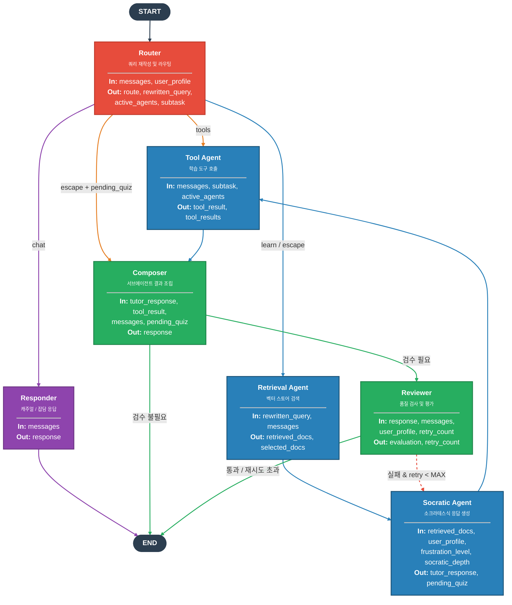
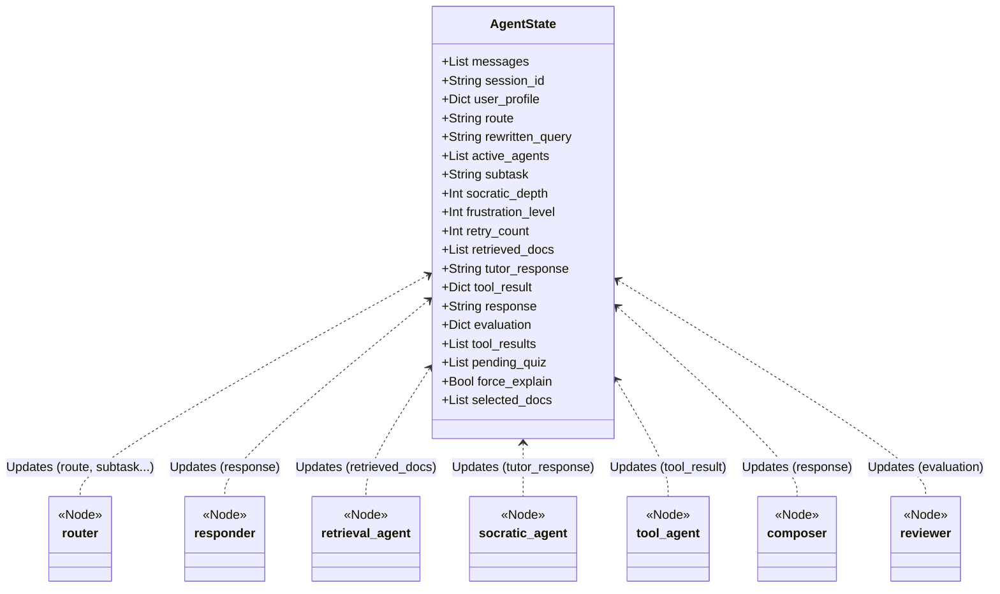

# SocrAItes LangGraph Architecture

이 문서는 `src/agent/graph.py` 및 `src/agent/state.py` 코드를 바탕으로 현재 구현된 LangGraph의 노드 구성, 라우팅 흐름, 그리고 각 노드의 상태(Input/Output)를 시각화한 문서입니다.

## 1. 노드 라우팅 및 제어 흐름 (Control Flow)

다음은 전체 에이전트의 실행 경로를 보여주는 플로우차트입니다. `router` 노드에서 사용자의 입력 및 상태를 분석하여 알맞은 경로로 분기하며, 각 단계를 거쳐 최종적으로 응답을 생성(`END`)합니다.

---

## 2. 노드별 상태 접근 및 데이터 플로우 (Data Flow)

각 노드는 공유되는 `AgentState` 객체를 읽고(Input) 업데이트(Output) 하는 방식으로 데이터를 교환합니다.

### 상세 상태 매핑표

| 노드 이름 | 주요 Input (읽기) | 주요 Output (쓰기) | 설명 |
|---|---|---|---|
| **`router`** | `messages`, `user_profile` | `route`, `rewritten_query`, `active_agents`, `subtask` | 대화 맥락을 파악하고 최적의 경로와 에이전트들을 결정합니다. |
| **`responder`** | `messages` | `response` | "chat" 경로 시 일상적인 대화나 인사말을 즉시 생성합니다. |
| **`retrieval_agent`** | `rewritten_query`, `messages` | `retrieved_docs`, `selected_docs` | RAG를 위해 재작성된 쿼리로 벡터 스토어를 검색하여 문서를 가져옵니다. |
| **`socratic_agent`** | `messages`, `retrieved_docs`, `user_profile`, `frustration_level`, `socratic_depth`, `pending_quiz`, `retry_count` | `tutor_response`, `pending_quiz` | 소크라테스식 문답을 구성하거나 퀴즈를 출제합니다. |
| **`tool_agent`** | `messages`, `subtask`, `active_agents` | `tool_result`, `tool_results` | 필요한 학습 도구를 실행하고 결과를 반환합니다. |
| **`composer`** | `tutor_response`, `tool_result`, `messages`, `pending_quiz` | `response` | 하위 에이전트들의 실행 결과(`tutor_response`, `tool_result` 등)를 하나의 텍스트 응답으로 조립합니다. |
| **`reviewer`** | `response`, `messages`, `user_profile`, `retry_count` | `evaluation`, `retry_count` | `response`의 품질(정답 누설 여부 등)을 검증하고, 실패 시 `retry_count`를 증가시킵니다. |
