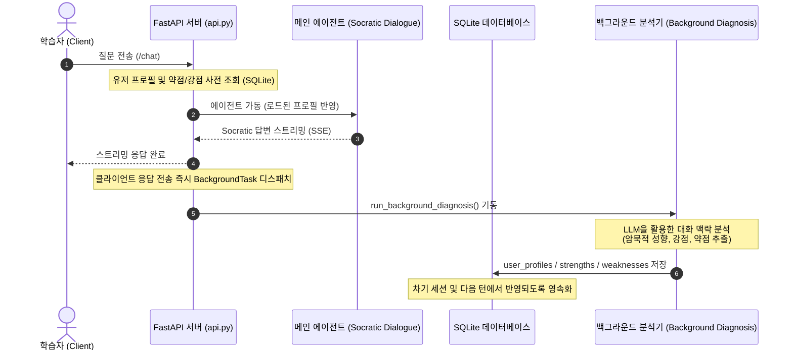

# 🦉 SocrAItes: 사용자 개인화 및 비동기 인지 분석 설계서 (User Personalization & Async Diagnosis)

본 문서는 SocrAItes의 단일 사용자(Single User), 다중 세션(Multi-session) 환경에서 학습자의 성향, 배경 지식, 그리고 개념적 강점 및 약점을 자동으로 분석하고 활용하는 **사용자 개인화 및 비동기 인지 분석(Asynchronous Cognitive Profiling)** 아키텍처를 정의합니다.

---

## 1. 아키텍처 개요 및 지연 시간(Latency) 최적화

기존 SocrAItes의 질의응답 그래프는 사용자의 즉각적인 퀴즈 출제나 직답 모드 전환 요구를 처리하기 위한 동적 툴 실행 노드(`diagnosis_agent`)를 포함하고 있습니다. 그러나 학습자의 장단점을 분석하고 학습 성향을 프로파일링하는 작업은 즉각적인 응답 생성을 방해하지 않는 **비동기적 성격**을 가집니다.

이를 최적화하기 위해 SocrAItes는 **FastAPI의 비동기 백그라운드 태스크(BackgroundTasks)** 구조를 도입하였습니다.



---

## 2. 데이터베이스 스키마 설계

사용자 프로필과 강점을 영속화하기 위해 SQLite 데이터베이스에 두 개의 테이블을 추가하였습니다.

### 2.1 `user_profiles` (학습 스타일 및 프로필)
학습자의 명시적/암묵적 선호도와 학업 배경 정보를 저장합니다.
```sql
CREATE TABLE IF NOT EXISTS user_profiles (
    user_id             TEXT PRIMARY KEY,             -- 사용자 식별자 (기본값 'default')
    learning_style      TEXT,                         -- 학습 성향: conceptual (이론적) | practical (실전/사례) | concise (간결)
    preferred_tone      TEXT,                         -- 선호 어조: encouraging (격려형) | strict (엄격형) | academic (학구형)
    academic_background TEXT,                         -- 학업 배경 (예: '컴퓨터공학과 학부생')
    notes               TEXT,                         -- 에이전트가 기록하는 자유 형태의 메모
    updated_at          TEXT NOT NULL                 -- 최신 갱신 일자
);
```

### 2.2 `strengths` (학습자 강점)
학습자가 높은 이해도를 보이거나 성공적으로 답변한 학술 개념들을 기록합니다.
```sql
CREATE TABLE IF NOT EXISTS strengths (
    id          INTEGER PRIMARY KEY AUTOINCREMENT,
    session_id  TEXT    REFERENCES sessions(id) ON DELETE SET NULL,
    concept     TEXT    NOT NULL,                     -- 강점을 보인 학술 개념 (예: 'Mutex와 상호 배제')
    details     TEXT,                                 -- 상세 내용 및 비유 사례
    created_at  TEXT    NOT NULL,
    updated_at  TEXT    NOT NULL
);
```

---

## 3. 학습 도구(Function Calling Tools) 신설

백그라운드에서 분석기가 인지 상태를 갱신할 수 있도록 신규 학습 도구 2종을 구현하였습니다.

1. **`update_user_profile`**: 
   * 학습 스타일, 선호 어조, 학업 배경, 종합 메모를 갱신하여 `user_profiles`에 저장합니다.
2. **`save_strength`**: 
   * 학생이 깊은 이해를 보인 특정 개념과 설명 방식을 `strengths`에 저장합니다.

---

## 4. 백그라운드 인지 진단 에이전트 (Background Diagnosis)

FastAPI SSE 스트리밍 응답이 정상 완료되면 `api.py`는 `run_background_diagnosis` 함수를 백그라운드 스레드로 격리하여 실행합니다.

### 4.1 암묵적(Implicit) 진단 프롬프트 설계
분석기는 학생이 스스로 "내 약점은 X야"라고 명시하지 않더라도 대화 흐름을 파악하여 장단점 및 성향을 자동으로 유추합니다.

* **암묵적 약점 감지**: 대화 중 오개념을 주장하거나, 연속적인 질문 이해 실패, 퀴즈의 대량 오답 발생 시 `save_weakness`를 자동으로 트리거합니다.
* **암묵적 강점 감지**: 소크라테스 반문에 명확하고 논리적인 설명을 제공하거나, 퀴즈 고득점(80% 이상) 달성 시 `save_strength`를 자동으로 트리거합니다.
* **성향 정보 갱신**: 학생이 "쉽게 예시로 설명해줘", "학부생이라 수식은 어려워요" 등 요구사항을 암시할 때 `update_user_profile`을 호출합니다.

---

## 5. 소크라테스 대화 엔진으로의 개인화 주입 (Socratic Adaption)

비동기로 축적된 유저 정보는 다음 턴 혹은 새로운 대화 세션이 로드될 때 Socratic Dialogue Agent의 질문 템플릿에 실시간 반영되어 맞춤형 학습을 유도합니다.

```
+-------------------------------------------------------------------------------+
|                             SocrAItes Tutor Prompt                            |
+-------------------------------------------------------------------------------+
|  1. 학습 성향 (Learning Style):                                               |
|     - practical: 실전 소프트웨어 아키텍처 및 소스코드 사례 우선 제시          |
|     - conceptual: 엄격한 이론적 배경과 정밀한 수식 우선 제시                  |
|     - concise: 1~2문장 내외로 설명을 아주 콤팩트하게 제한                     |
|                                                                               |
|  2. 선호 어조 (Preferred Tone):                                               |
|     - encouraging: 친근한 칭찬, 공감 표현 다수 사용                           |
|     - strict: 불필요한 미사여구를 배제하고 개념의 핵심 오류를 직설적으로 반문 |
|     - academic: 논문 및 연구 어투의 정밀한 대학원생용 전문 용어 사용          |
|                                                                               |
|  3. 강점 활용 (Leverage Strengths):                                           |
|     - 과거 마스터한 강점 개념(예: Mutex)을 토대로 유추 가능한 비유 설계       |
|                                                                               |
|  4. 약점 보완 (Address Weaknesses):                                           |
|     - 취약했던 부분(예: 데드락 예방 기법)을 만났을 때 점진적인 힌트 제공       |
+-------------------------------------------------------------------------------+
```

---

## 6. 검증 및 테스트 결과

* **시나리오**: 세마포어(Semaphore) 카운트의 가치 범위를 0과 1로만 한정하여 오해하고 있던 학생이 질문하는 대화를 모의 시뮬레이션하였습니다.
* **검증 결과**:
  1. API 응답은 지연 없이 즉각 반환되었습니다.
  2. 전송 종료 직후, 백그라운드 태스크가 성공적으로 기동하여 사용자 대화 중 전공 배경("보안공학과 학부생")을 판별해 유저 프로필을 비동기로 갱신하였습니다.
  3. 세마포어 값의 범위에 대한 오해를 감지하여 `save_weakness`를 자동으로 실행해 데이터베이스에 무사히 인입시켰습니다.
