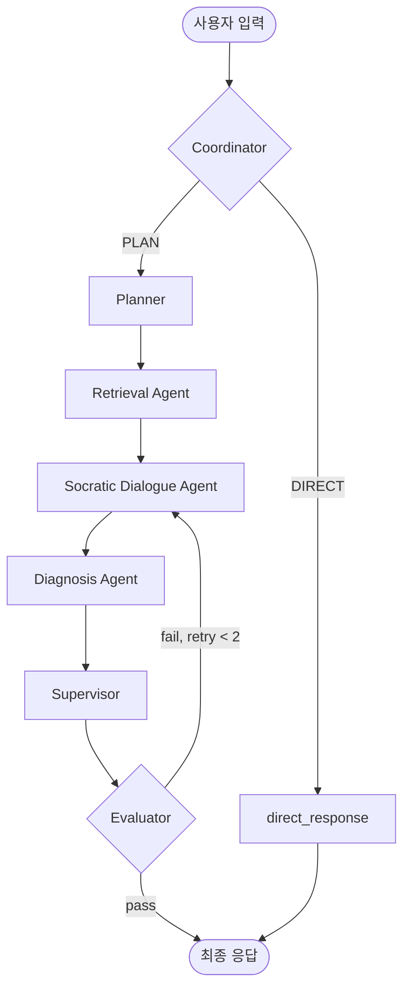

# Sub Agent 구현 명세 - SocrAItes

이 문서는 SocrAItes의 3계층 에이전트 아키텍처 중 **Sub Agent 레이어**의 구현 내용을 설명합니다.

---

## 1. 배경 및 목적

기존 구현에서는 Supervisor 하나가 RAG 검색 결과 합성, 소크라테스식 질문 생성, 도구 호출을 모두 담당했습니다. 이로 인해:

- 도구 호출 시점이 LLM의 즉흥적 판단에 의존
- 소크라테스 충실도 검증 로직 부재 (Evaluator가 항상 `pass=True`)
- 역할 경계가 불명확해 디버깅/평가가 어려움

Sub Agent 분리를 통해 **라우팅 → 계획 → 실행 → 종합 → 검증** 각 단계의 책임을 분리했습니다.

---

## 2. 전체 그래프 흐름



---

## 3. Planner — Sub Agent 선택

**파일**: `src/agent/core/planner.py`

Planner는 매 턴마다 어떤 Sub Agent를 실행할지 결정합니다.

### 선택 규칙

| Sub Agent | 실행 조건 |
|---|---|
| `retrieval` | 강의 자료 검색이 필요한 학습 쿼리 (기본 포함) |
| `dialogue` | 소크라테스식 대화가 필요한 학습 쿼리 (기본 포함) |
| `diagnosis` | 퀴즈 요청, 약점 저장, 일정 등록, 직접 답변 요청, 또는 반복적 오개념 감지 시 |

### 출력 (JSON)

```json
{
  "sub_agents": ["retrieval", "dialogue"],
  "subtask": "LoRA 관련 슬라이드 검색 후 반문 생성",
  "reasoning": "학습 쿼리이므로 retrieval + dialogue 선택"
}
```

결과는 `state["sub_agents"]`와 `state["plan"]`에 저장됩니다.

---

## 4. Sub Agent 상세

### 4.1 Retrieval Agent

**파일**: `src/agent/sub_agents/retrieval.py`

강의 자료(PDF)에서 관련 청크를 검색합니다.

| 항목 | 내용 |
|---|---|
| 실행 조건 | `"retrieval" in state["sub_agents"]` |
| 호출 도구 | Elasticsearch (BM25 + Dense KNN 하이브리드) |
| 입력 | `state["contextualized_query"]` |
| 출력 | `state["retrieved_docs"]` — 상위 5개 청크 |

```python
# 핵심 로직
results = vectorstore.query(query, k=5)
state["retrieved_docs"] = results
```

---

### 4.2 Socratic Dialogue Agent

**파일**: `src/agent/sub_agents/dialogue.py`

검색된 강의 자료와 대화 이력을 바탕으로 소크라테스식 질문/힌트를 생성합니다.

| 항목 | 내용 |
|---|---|
| 실행 조건 | `"dialogue" in state["sub_agents"]` |
| 호출 도구 | LLM API (GPT-4o-mini) |
| 입력 | `retrieved_docs`, `messages`, `socratic_depth`, `frustration_level` |
| 출력 | `state["socratic_response"]` |

#### 동작 규칙

- **기본**: 1-2문장 힌트 → 구체적 소크라테스 질문
- **요약 요청 감지** (`요약`, `정리` 키워드): 강의 자료 전체 구조화 요약 → 소크라테스 질문
- **좌절 감지** (`frustration_level >= 2`): 더 상세한 힌트(Scaffolding) 제공 후 질문
- **Evaluator 재시도 시**: `eval_feedback`을 프롬프트에 포함해 품질 개선

#### Socratic Depth 모드

| 값 | 모드 | 설명 |
|---|---|---|
| 0 | Light | 1-2턴 반문 |
| 1 | Standard | 3-4턴 반문 (기본값) |
| 2 | Deep | 5턴 이상 심화 반문 |

---

### 4.3 Diagnosis Agent

**파일**: `src/agent/sub_agents/diagnosis.py`

대화 이력을 분석하고 필요한 학습 도구를 호출합니다.

| 항목 | 내용 |
|---|---|
| 실행 조건 | `"diagnosis" in state["sub_agents"]` |
| 호출 도구 | `generate_quiz`, `save_weakness`, `schedule_review`, `escape_to_answer` |
| 입력 | `messages`, `plan`, `frustration_level` |
| 출력 | `state["diagnosis_result"]` — 분석 텍스트 + 도구 결과 |

#### 도구 호출 기준

| 도구 | 호출 조건 |
|---|---|
| `generate_quiz` | 학생이 퀴즈/연습문제를 명시적으로 요청한 경우 |
| `save_weakness` | 대화에서 명확한 개념 공백이 식별된 경우 |
| `schedule_review` | 학생이 복습 일정 등록을 요청한 경우 |
| `escape_to_answer` | "그냥 답 알려줘" 등 직접 답변 요청 시 |

```python
# diagnosis_result 구조
state["diagnosis_result"] = {
    "analysis": "분석 텍스트",
    "tool_results": [...],    # 도구 실행 결과
    "tool_calls_made": 1,
}
```

---

## 5. Supervisor — 합성

**파일**: `src/agent/core/supervisor.py`

Sub Agent 출력물을 우선순위에 따라 합성해 최종 초안을 생성합니다.

```
우선순위:
1. 퀴즈 채점  (pending_quiz + 답안 제출 감지)
2. Diagnosis 도구 결과  (퀴즈 생성 → escape → 약점/일정)
3. Socratic Dialogue Agent 응답
4. Fallback LLM 생성
```

Supervisor는 직접 LLM으로 소크라테스 질문을 생성하지 않습니다. Sub Agent 결과를 받아 포맷/합성만 담당합니다.

---

## 6. Evaluator — 4축 품질 검증

**파일**: `src/agent/core/evaluator.py`

초안 응답을 4개 축으로 평가하고, 품질 미달 시 재시도를 트리거합니다.

| 축 | 설명 | 기준 |
|---|---|---|
| `socratic` | 직접 답변 회피, 소크라테스 질문 사용 | 5=완전 소크라테스, 1=직접 답변 |
| `grounding` | 강의 자료 기반 응답 | 5=명확히 인용, 1=무관 |
| `encouragement` | 따뜻하고 격려하는 톤 | 5=매우 격려적, 1=냉담 |
| `clarity` | 명확하고 구조적인 응답 | 5=매우 명확, 1=혼란스러움 |

**통과 기준**: 4개 축 모두 점수 ≥ 3

**재시도 루프**: 실패 시 `retry_count`를 증가시키고 Socratic Dialogue Agent로 라우팅. 최대 2회 재시도 후 강제 종료.

```python
# 평가 결과 구조
state["evaluation"] = {
    "pass": True,
    "feedback": "소크라테스 질문이 너무 모호합니다. 구체적인 개념을 지목해주세요.",
    "scores": {"socratic": 4, "grounding": 3, "encouragement": 5, "clarity": 4}
}
```

---

## 7. State 필드 추가 내역

Sub Agent 구현에 따라 `AgentState`에 다음 필드가 추가되었습니다.

| 필드 | 타입 | 설명 |
|---|---|---|
| `sub_agents` | `List[str]` | Planner가 선택한 Sub Agent 목록 |
| `socratic_response` | `str` | Socratic Dialogue Agent 출력 |
| `diagnosis_result` | `Dict` | Diagnosis Agent 분석 + 도구 결과 |
| `retry_count` | `int` | Evaluator 재시도 횟수 |

---

## 8. 파일 구조

```
src/agent/
├── graph.py              # 그래프 배선만 (70줄)
├── state.py              # AgentState 정의
├── llm.py                # LLM 인스턴스 + 도구 호출 유틸
├── helpers.py            # 트레이스 로깅, 텍스트 감지, 퀴즈 헬퍼
├── core/
│   ├── coordinator.py    # Coordinator 노드
│   ├── planner.py        # Planner 노드
│   ├── supervisor.py     # Supervisor 노드
│   └── evaluator.py      # Evaluator 노드 + direct_response
└── sub_agents/
    ├── retrieval.py      # Retrieval Agent
    ├── dialogue.py       # Socratic Dialogue Agent
    └── diagnosis.py      # Diagnosis Agent
```

---

## 9. 주요 설계 결정

**도구 호출을 Diagnosis Agent로 이전**

기존에는 Supervisor가 LLM 판단으로 즉흥적으로 도구를 호출했습니다. 이제 Planner가 `diagnosis`를 명시적으로 선택할 때만 도구 호출이 발생합니다. 도구 호출 시점이 예측 가능해지고 불필요한 API 호출이 줄어듭니다.

**Evaluator 재시도는 Socratic Dialogue Agent로만 라우팅**

품질 재시도 시 Retrieval과 Diagnosis는 재실행하지 않습니다. 이미 검색된 자료와 도구 결과를 그대로 두고, 소크라테스 표현만 개선합니다. 불필요한 ES 쿼리와 도구 호출을 방지합니다.

**성능 트레이드오프**

Sub Agent 분리로 LLM 호출이 턴당 약 2회 증가합니다 (Dialogue Agent + Evaluator 추가). 응답 지연이 늘어나는 대신 소크라테스 충실도와 도구 호출 정확도가 향상됩니다.
