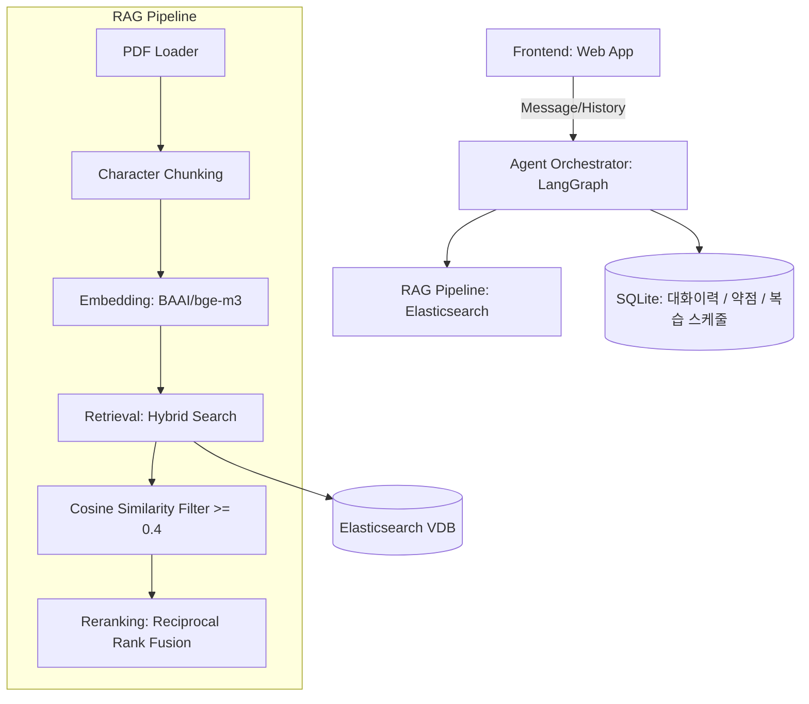
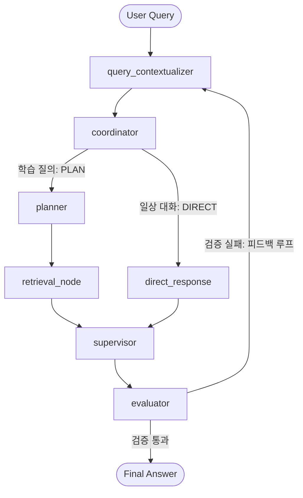

# System Design & Architecture - SocrAItes

본 문서는 소크라테스식 인공지능 학습 코치 **SocrAItes**의 전체 시스템 아키텍처, 상태 관리 설계, RAG 파이프라인, 그리고 멀티턴 대화에서 지명 대명사 및 생략어를 극복하는 **문맥 인지형 쿼리 재구성(Context-Aware Query Reformulation)** 메커니즘을 상세히 다룹니다.

---

## 1. 시스템 아키텍처 개요

SocrAItes 시스템은 사용자 인터페이스(Frontend), 대화 제어 및 에이전트 오케스트레이션(Agent Orchestrator), 검색 증강 생성(RAG Pipeline), 데이터 지속성 계층으로 구성됩니다.

### 1.1 하이레벨 아키텍처


---

## 2. 문맥 인지형 대화 역사 관리 (Historical Context Management)

멀티턴 대화에서 학습자는 이전 문맥을 전제로 **"그거 조건이 뭐야?"** 또는 **"예방은 어떻게 해?"**와 같은 생략 및 지시어 표현을 자주 사용합니다. RAG 파이프라인의 검색 정확도를 보장하기 위해, SocrAItes는 대화 이력의 맥락을 완벽하게 녹여낸 단독 질문을 재구성합니다.

### 2.1 동작 원리 (Context-Aware Reformulation)
1. 사용자가 최신 메시지를 입력하면, 에이전트는 즉시 대화 내역(`state["messages"]`)을 분석합니다.
2. 이전 대화 기록이 존재할 경우, 최신 메시지와 결합하여 **지시 대명사("그거", "이거")를 복원**하고 **생략된 학술적 주제("데드락", "NLU" 등)를 채워 넣은** 단독 실행 가능 쿼리(`contextualized_query`)를 재생성합니다.
3. 첫 번째 턴(인사 등)에서는 연산 비용 절감을 위해 LLM 재구성을 자동으로 스킵하고 원본 쿼리를 그대로 사용합니다.
4. 재구성된 쿼리는 검색 엔진(Elasticsearch)과 세부 계획 수립(Planner)에 타겟 정보로 투입되어 RAG 성능을 극대화합니다.

---

## 3. 에이전트 노드별 상세 동작 및 입출력 예시 (LangGraph Node Specification)

LangGraph 기반의 워크플로우를 구성하는 7개 노드의 역할과 실제 대화 세션 기반의 구체적인 입출력 시나리오 예시입니다.



---

### [Node 1] query_contextualizer (문맥 인지 쿼리 재구성기)
* **역할:** 이전 대화 기록과 학생의 최신 발화를 융합하여, RAG 검색 및 주제 분류에 최적화된 한국어 독립 단독 쿼리(Standalone Query)를 재생성합니다.
* **입출력 데이터 예시:**
  * **Input Context (대화 이력):**
    ```yaml
    - Student: "OS에서 데드락에 대해 알고 싶어요."
    - Tutor: "데드락은 자원을 기다리며 무한 대기하는 상태입니다... (생략)"
    - Student (최신 입력): "그거 발생 조건이 뭐야?"
    ```
  * **Output (Contextualized Query):**
    ```yaml
    contextualized_query: "데드락이 발생하는 조건은 무엇인가요?"
    ```

---

### [Node 2] coordinator (학습 경로 분류기)
* **역할:** 재구성된 쿼리를 언어적으로 분석하여, 학술적 개념 학습이 필요한 질의(`PLAN` 경로)인지 혹은 단순 인사 및 일상적 대화(`DIRECT` 경로)인지 판단하여 분기합니다.
* **입출력 데이터 예시:**
  * **Input Context:**
    ```yaml
    contextualized_query: "데드락이 발생하는 조건은 무엇인가요?"
    ```
  * **Output (Routing Decision):**
    ```yaml
    route: "planner"  # 학술 질문으로 판별되어 플래너 노드로 이동
    ```

---

### [Node 3] planner (학습 계획 설계자)
* **역할:** 사용자의 학습 성향과 Socratic Depth 수준(Light, Standard, Deep)을 바탕으로 탐구 타겟을 정의하고, 튜터링 세션의 세부 실행 계획(Plan)을 수립합니다.
* **입출력 데이터 예시:**
  * **Input Context:**
    ```yaml
    query: "데드락이 발생하는 조건은 무엇인가요?"
    socratic_depth: 1 (Standard)
    ```
  * **Output (Socratic Plan):**
    ```json
    {
      "should_retrieve": "Yes",
      "core_concept": "Operating System Deadlock Conditions",
      "target_inquiry": "상호 배제, 점유 및 대기, 선점 불가, 순환 대기 조건을 하나씩 해부하도록 유도",
      "plan_description": "검색된 OS 강의자료를 참고하여 데드락 발생 4대 조건을 스스로 발견할 수 있도록 유도한다."
    }
    ```

---

### [Node 4] retrieval_node (하이브리드 RAG 검색기)
* **역할:** Elasticsearch를 대상으로 `BM25 형태소 검색`과 `BAAI/bge-m3 Dense 벡터 검색`을 결합한 하이브리드 검색을 수행하고, **코사인 유사도 임계값 필터링(`>= 0.4`)** 및 **RRF(Reciprocal Rank Fusion)**를 적용해 완벽하게 유의미한 강의 조각만을 엄선합니다.
* **입출력 데이터 예시:**
  * **Input Context (Search Query):**
    ```yaml
    search_query: "데드락이 발생하는 조건은 무엇인가요?"
    index_contents: "자연어처리 관련 슬라이드만 존재 (데드락 내용 없음)"
    ```
  * **Similarity Thresholding & Filtering (내부 연산):**
    * 후보 1: *"자연어처리(NLP)란?..."* ──> 코사인 유사도: `0.18` (0.4 미만 필터아웃)
    * 후보 2: *"NLU의 핵심 태스크..."* ──> 코사인 유사도: `0.12` (0.4 미만 필터아웃)
  * **Output (Retrieved Chunks):**
    ```yaml
    retrieved_docs: []  # 무관한 문서는 전원 탈락하여 깔끔하게 빈 리스트 전달
    ```

---

### [Node 5] direct_response (일상 대화 응답기)
* **역할:** `coordinator`가 일상 대화(`DIRECT`)로 판별한 인풋(예: "안녕하세요!", "고마워요")에 대해, 소크라테스 대화법 대신 친절하고 자연스러운 인삿말 및 기능 안내를 임시 답변으로 도출합니다.
* **입출력 데이터 예시:**
  * **Input Context:**
    ```yaml
    user_message: "안녕하세요!"
    ```
  * **Output (Direct Draft):**
    ```yaml
    draft_answer: "안녕하세요! 소크라테스 튜터 SocrAItes입니다. 어떤 과목이나 개념을 탐구해보고 싶으신가요?"
    ```

---

### [Node 6] supervisor (소크라테스 대화 조율자)
* **역할:** 검색된 강의자료 컨텍스트와 대화의 흐름을 융합하여 Socratic 답변 초안을 생성합니다. 정답을 흘리지 않으면서, **1~2줄의 고수준 직관적 힌트(Scaffolding)**를 먼저 친절히 주고, 이어서 학습자의 **메타인지를 자극하는 날카로운 질문**을 덧붙입니다.
* **입출력 데이터 예시:**
  * **Input Context:**
    ```yaml
    contextualized_query: "데드락 예방 방법은 무엇인가요?"
    retrieved_docs: []  # RAG 검색 결과 없음 (자체 지식 기반 가이드라인 형성)
    history: "데드락 정의와 4대 발생 조건을 탐구한 상태"
    ```
  * **Output (Socratic Draft Response):**
    ```text
    데드락 예방을 위해서는 방금 알아본 네 가지 발생 조건(상호배제, 점유대기, 비선점, 순환대기) 중 하나 이상을 원천적으로 불가능하게 만들어야 합니다. 예를 들어 점유 및 대기를 피하기 위해 필요한 자원을 한 번에 요청하는 전략을 쓸 수 있습니다.
    
    그렇다면 이 네 가지 예방 전략 중, 실제 운영체제 환경에서 시스템 자원을 가장 덜 낭비하고 효율적일 것 같은 방법은 무엇이라고 생각하시나요? 그렇게 생각하는 설계적 이유는 무엇인가요?
    ```

---

### [Node 7] evaluator (답변 품질 평가자)
* **역할:** 완성된 답변 초안이 SocrAItes의 튜터링 원칙을 철저하게 준수하고 있는지(정답 노출 유무, 한국어 어조의 자연스러움, 메타인지 유도 질문 포함 여부) 자가 평가(Self-Correction)하여 통과 또는 재작성을 결정합니다.
* **입출력 데이터 예시:**
  * **Input Context (Draft Response):**
    ```text
    "데드락 예방을 위해서는 조건을 없애야 합니다... (중략) ...가장 효율적일 것 같은 방법과 설계적 이유는 무엇인가요?"
    ```
  * **Output (Evaluation JSON):**
    ```json
    {
      "pass": true,
      "feedback": "답변이 지나치게 정답을 직접 서술하지 않으며, 힌트 후속 질문으로 메타인지를 훌륭히 자극하고 있습니다. 검증 통과."
    }
    ```

---

## 4. 데이터 파이프라인 및 상태 관리

* **Vector DB (Elasticsearch):** BGE-M3 1024차원 고성능 임베딩 모델과 Nori 한글 형태소 분석기 토크나이저 설정을 결합하여 하이브리드 RAG 데이터베이스를 구축하였습니다.
* **상태 관리 (StateGraph Schema):** LangGraph의 메모리 모델을 타고 아래의 상태 변수들이 유기적으로 실시간 변경/동기화됩니다.
  * `messages`: 대화 턴 히스토리 누적 객체.
  * `contextualized_query`: 문맥 복원 및 대명사 해소가 완료된 Standalone 한글 쿼리.
  * `socratic_depth`: 학습 강도 수준 (Light=0, Standard=1, Deep=2).
  * `plan`: 플래너가 수립한 학습 이정표 스키마 객체.
  * `retrieved_docs`: 코사인 유사도 0.4 검증을 통과해 살아남은 정예 강의자료 텍스트 조각 목록.
  * `draft_answer`: SUPERVISOR가 설계한 답변 최종 후보.
