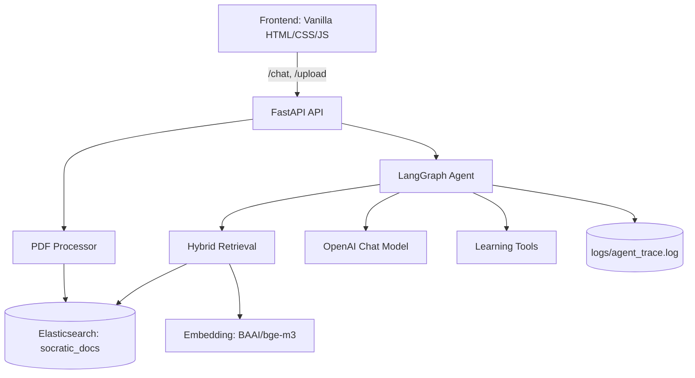

# System Design & Architecture - SocrAItes

## 1. 시스템 아키텍처 개요

SocrAItes는 FastAPI 백엔드, LangGraph 기반 에이전트 오케스트레이션, Elasticsearch 하이브리드 검색, 로컬 임베딩 모델(bge-m3)로 구성됩니다.

### 1.1 하이레벨 아키텍처

## 2. 주요 런타임 컴포넌트

### 2.1 API 계층 (`src/api.py`)

1. `POST /chat`
    - 대화 메시지를 받아 LangGraph를 실행하고 `draft_answer`를 반환
2. `POST /upload`
    - PDF를 업로드 받아 청킹 후 Elasticsearch 인덱스에 적재
3. `GET /health`
    - 서비스 헬스체크

### 2.2 Agent 계층 (`src/agent/graph.py`)

현재 그래프는 아래 노드 순서로 동작합니다.

1. `coordinator`
2. `planner` 또는 `direct_response`
3. `retrieval`
4. `supervisor`
5. `evaluator`

노드 내부에서 LLM 호출 및 상태 업데이트를 수행하며, 상세 실행 로그를 `logs/agent_trace.log`에 기록합니다.

### 2.3 RAG 계층 (`src/rag/*`)

1. `document_processor.py`
    - PyMuPDF 기반 페이지 로드 + `RecursiveCharacterTextSplitter` 청킹
2. `embeddings.py`
    - `BAAI/bge-m3` 로컬 모델 로드
    - 디바이스 자동 선택(`mps` -> `cuda` -> `cpu`)
3. `vectorstore.py`
    - Elasticsearch 인덱스 생성/적재/조회
    - BM25 + Dense KNN 결과를 RRF로 결합

## 3. 검색 아키텍처 (Hybrid Retrieval)

Elasticsearch 인덱스 `socratic_docs`는 다음 필드를 중심으로 운영됩니다.

1. `text` (korean analyzer)
2. `dense_vector` (1024 dims, cosine)
3. `source`, `page`, `chunk_index`

조회 시,

1. BM25 검색
2. Dense KNN 검색
3. RRF(Reciprocal Rank Fusion) 점수 합산

을 통해 최종 상위 `k`개 문서를 선택합니다.

## 4. 상태 모델

에이전트 상태(`AgentState`)는 다음 핵심 필드를 사용합니다.

1. `messages`
2. `socratic_depth`
3. `retrieved_docs`
4. `plan`
5. `draft_answer`
6. `next_step`

## 5. 운영 구성

1. 애플리케이션: FastAPI (`uvicorn src.api:app --reload`)
2. 검색 인프라: Docker Compose 기반 Elasticsearch + Kibana
3. 임베딩: 로컬 bge-m3 (최초 1회 다운로드 필요)

## 6. 설계 원칙

1. 문서/코드 동기화: 런타임 기준은 README와 본 문서를 우선
2. 레거시 분리: 과거 ChromaDB 기반 문서는 `docs/legacy/`에서만 관리
3. 정본 우선: 아키텍처 변경 시 본 문서를 먼저 수정
